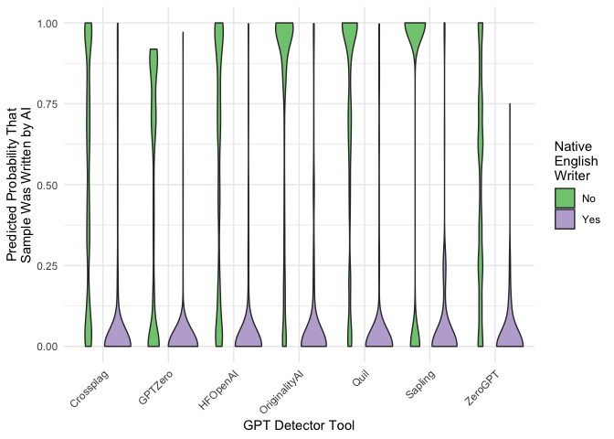

# detectors

`detectors` is an R data package containing predictions from various GPT
detectors. The data is based on the paper:

**GPT Detectors Are Biased Against Non-Native English Writers.** *Weixin
Liang*, *Mert Yuksekgonul*, *Yining Mao*, *Eric Wu*, *James Zou.*
[CellPress Patterns](https://doi.org/10.1016/j.patter.2023.100779).

The study authors carried out a series of experiments passing a number
of essays to different GPT detection models. Juxtaposing detector
predictions for papers written by native and non-native English writers,
the authors argue that GPT detectors disproportionately classify real
writing from non-native English writers as AI-generated.

## Installation

You can install the data package with the following code:

``` r
require(pak)
pak("detectors")
```

## Example

Taking a look at the data:

``` r
library(ggplot2)
library(detectors)

detectors
```

    ## # A tibble: 6,185 × 9
    ##    kind  .pred_AI .pred_class detector     native name  model document_id prompt
    ##    <fct>    <dbl> <fct>       <chr>        <chr>  <chr> <chr>       <dbl> <chr> 
    ##  1 Human 1.00     AI          Sapling      No     Real… Human         497 <NA>  
    ##  2 Human 0.828    AI          Crossplag    No     Real… Human         278 <NA>  
    ##  3 Human 0.000214 Human       Crossplag    Yes    Real… Human         294 <NA>  
    ##  4 AI    0        Human       ZeroGPT      <NA>   Fake… GPT3          671 Plain 
    ##  5 AI    0.00178  Human       Originality… <NA>   Fake… GPT4          717 Eleva…
    ##  6 Human 0.000178 Human       HFOpenAI     Yes    Real… Human         855 <NA>  
    ##  7 AI    0.992    AI          HFOpenAI     <NA>   Fake… GPT3          533 Plain 
    ##  8 AI    0.0226   Human       Crossplag    <NA>   Fake… GPT4          484 Eleva…
    ##  9 Human 0        Human       ZeroGPT      Yes    Real… Human         781 <NA>  
    ## 10 Human 1.00     AI          Sapling      No     Real… Human         460 <NA>  
    ## # ℹ 6,175 more rows

An example plot demonstrates the distributions of predicted
probabilities that a text sample was written by AI depending on the GPT
detector model and lived experience in writing English of the author:

``` r
detectors_plot <- 
  detectors[!is.na(detectors$native), ] %>%
  ggplot() +
  aes(x = detector, y = .pred_AI, fill = native) +
  geom_violin(bw = .05) +
  labs(
    x = "GPT Detector Tool",
    y = "Predicted Probability That\nSample Was Written by AI",
    fill = "Native\nEnglish\nWriter"
  ) +
  theme_minimal() +
  scale_fill_brewer(type = "qual") +
  theme(axis.text.x = element_text(angle = 45, vjust = 1, hjust = 1))

detectors_plot
```

<figure>

<figcaption aria-hidden="true">“A ggplot side-by-side density plot
showing the distributions of predicted probabilities that a text sample
was written by AI depending on the GPT detector model and lived
experience in writing English of the author. All shown models classify
samples written by native English writers well, and do so variably
poorly for non-native English writers.”</figcaption>
</figure>
